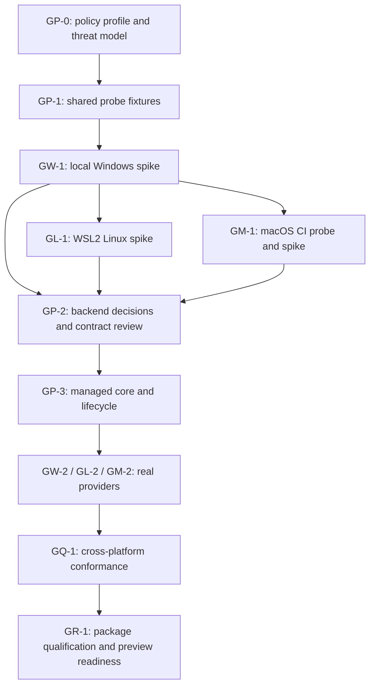

# Gagamba implementation plan

Status: actionable planning baseline, 2026-10-03; progress notes 2026-10-04. GP-0 is complete as a document. GP-1A/GP-1B fixtures, GW-1A availability and GW-1B Windows launch slices 1–4 are implemented as spikes (14/19 launch legs green; four engine gates open). Runtime production implementation has not started. The [current queue](work-queue.md) and [handoff](handoff.md) record the exact checkpoint; local inventory is recorded in [test environments](test-environments.md).

This is the canonical implementation sequence. The [design](design.md) defines the proposed semantics, the [research plan](research-plan.md) contains backend experiments, and the [testing and CI plan](testing-and-ci.md) defines evidence and automation. Later implementation findings may revise the design through recorded decisions.

## Outcome

Deliver an independently usable .NET library that runs a command and its descendants inside an explicit, verified execution boundary on Windows, Linux, and macOS. Start testing on the user's Windows host, then use a separate Linux WSL2 distribution and GitHub macOS runners. Hufu, Luban, workflow adapters, approval systems, remote execution, and OpenShell integration are outside this delivery plan.

The first useful release is an experimental offline runner. A three-platform claim requires qualified evidence on all three platforms; an unavailable or failed backend never falls back to ordinary execution.

## Working implementation choices

These are proposed defaults to keep work concrete, not claims of existing implementation:

| Area | Initial choice |
| --- | --- |
| Managed runtime | .NET 10 for the first spike and preview, matching the installed SDK; assess other TFMs after feasibility rather than multiplying the initial matrix |
| Supported architecture candidates | Windows x64, Linux x64, macOS ARM64 and x64; other architectures need their own qualification |
| Execution | One immutable prepared request and one process tree per sandbox; no concurrent reuse or persistent session |
| Filesystem | Caller-selected read-only and read/write subtrees plus explicit runtime grants; ungranted host data inaccessible |
| Scratch | Private per-execution scratch; controlled disposable workspace fixtures first |
| Network | Denied; no endpoint allowlist or unrestricted-network mode in the first profile |
| Environment | Explicit allowlist and documented required OS variables; no automatic host inheritance |
| I/O | Bounded stdout/stderr with concurrent draining; explicit stdin; no PTY initially |
| Limits | Wall-clock deadline and output bounds mandatory; CPU, memory and process limits independently reported and rejected if requested but unsupported |
| Helpers | Native launcher/helper allowed when needed; exact versions and trusted resolution outside target-writable paths |
| Publication | Local package candidates first; CI qualification before a separate release decision |

The first profile must state what directory read/write actually includes. Do not describe a broad write grant as permission to apply only a particular patch. Runtime grants are visible caller inputs, not backend exceptions.

## Delivery order and dependencies



Linux and macOS research need not wait for a production Windows implementation. Begin with the local Windows fixture and then reuse it across platforms. No fixed dates are assigned until the backend spikes resolve the main unknowns.

| ID | Deliverable | Dependencies | Exit gate |
| --- | --- | --- | --- |
| GP-0 | Complete as documented design baseline | Current design | offline-process-v1 recorded; no enforcement claim |
| GP-1 | Probe host, controlled workers and evidence format | GP-0 | Workers and positive/negative test controls are reliable without claiming a sandbox |
| GW-1 | Windows API and compatibility report | GP-1 | Backend candidate demonstrated or rejected with reproducible evidence |
| GL-1 | Linux namespace/seccomp report | GP-1; begin after first local Windows probe | Minimum profile tested in WSL2 and hosted/native Linux differences documented |
| GM-1 | macOS capability and compatibility report | GP-1; CI repository available | Mechanism and owned lifetime demonstrated, or explicit unresolved blocker |
| GP-2 | Provider ADRs, public contract candidate and support matrix | All three spikes | Shared semantics survive each platform; unsupported shapes explicit |
| GP-3 | Managed preparation/lifecycle implementation | GP-2 | Focused core tests pass; no usable unrestricted production provider |
| GW-2 / GL-2 / GM-2 | Production-shaped experimental providers | GP-3 and respective spike | Shared conformance and workload profile pass for each provider |
| GQ-1 | Repeated adversarial, crash and compatibility qualification | All required providers | No failed/missing required cases; independent review findings resolved |
| GR-1 | Local NuGet candidates and isolated consumers | GQ-1 | Exact candidate packages and helpers reproduce qualified behavior |

CI grows with these gates; it is not a final phase bolted on after implementation.

## GP-0 — settle the supported profile

- [x] Write `docs/security-model.md` and version the initial profile, provisionally `offline-process-v1`.
- [x] Define access semantics for metadata, enumeration, traversal, file content, executable mappings, create, modify, delete and rename. Reject unsupported write-only rules and ambiguous/conflicting overlaps.
- [x] Specify path binding and alias behavior: symlinks/junctions, hardlinks, reparse points, non-existing output paths, case, mount boundaries, UNC/device paths and alternate streams.
- [x] Define the supported namespace threat model. Separate a controlled workspace from one another process can rearrange during preparation or execution; never imply canonical strings solve races.
- [x] Specify runtime profile expansion, private scratch, safe cache use, and whether any OS baseline access is unavoidable. No invisible read grants.
- [x] Define lifetime completion, stop acknowledgement, root exit, cancellation races, output overflow and cleanup failure.
- [x] Define network denial precisely, including host loopback, IPv6, UDP, DNS, inherited connections and exposed IPC. Resolve whether isolated intra-sandbox loopback is allowed.
- [x] Record exclusions: trusted kernel/host, no malicious in-process host plugins, no rollback or exact patch semantics, no full denial-of-service protection without corresponding OS limits.

Exit met as documentation: [offline-process-v1](security-model.md) specifies the baseline. This closes research gate G0 for design only; no backend is qualified.

## GP-1 — shared probes and test fixtures

Create a small managed probe host and controlled worker programs. Their protocol should work on all target systems and avoid dependence on shell-specific output parsing. They are test tools, not public packages.

- [x] Add fixture commands for read/write/create/delete/rename, spawning children/grandchildren, attempted daemonization, large output, hanging, and deterministic exit.
- [ ] Add bounded local TCP/UDP listeners and filesystem sentinels outside the target's grants. Use synthetic data only. *(sentinel isolation done; network listeners pending F4)*
- [x] Add explicit worker handshakes/barriers for launch/cancel races; use deadlines, not arbitrary sleeps, to decide failure.
- [ ] Add a fixture-only native worker where managed code cannot exercise relevant OS operations. *(pending)*
- [x] Emit a versioned JSON evidence report plus ordinary test results. Distinguish Passed, Failed, Unsupported and NotRun.
- [x] Use a disposable workspace root and an external watchdog to clean test-owned resources if a candidate launcher fails.
- [x] Demonstrate unsandboxed controls can reach the sentinel or listener before evaluating a sandbox denial. These controls must never be exposed as a library fallback.

Exit: trustworthy fixture behavior, reliable cleanup, and no tests incorrectly credited to an outer container or missing prerequisite.

## GW-1 — local Windows feasibility

Start here after GP-1, on the current Windows host and within disposable fixture directories.

- [x] Record exact OS/build, architecture, filesystem, token privilege, existing job membership and API exports.
- [x] Obtain and pin a verified schema matching `Experimental_CreateProcessInSandbox`; do not infer field layouts from prose.
- [~] Prove minimal creation, denied filesystem/network access, explicit environment and captured stdout/stderr/stdin. Handle inheritance is an explicit early question in the documented API. *(creation, filesystem denial and pipe capture proven; network denial and file-handle stdio open)* [Microsoft API](https://learn.microsoft.com/en-us/windows/win32/secauthz/createprocessinsandbox)
- [~] Establish containment before target code runs, then verify child restrictions, job nesting/breakaway behavior, root exit and launcher-crash cleanup. *(child restrictions, inherited denial and launcher-crash recovery proven; engine does not stop descendants on root exit — supervisor compensates)*
- [x] Verify identity isolation and profile/ACL/network artifacts before/after failure and concurrent runs.
- [~] Run offline .NET build/test, Git inspection, PowerShell and cmd fixtures with explicit dependency grants and contained/disabled build servers. *(cmd proven; dotnet runtime and Git install grants blocked — see evidence)*
- [x] Write a backend ADR: use the API, supplement it, or reject it. If rejected, run a bounded second spike for restricted tokens/dedicated identity or an existing runtime using the same tests. *([ADR 0001](adr/0001-windows-provider.md): API + supervisor, prototyping)*

Exit: W1/W2 evidence and a mechanism choice. Export availability or a successful command alone does not pass. If machine-wide installation/elevation is required, first document concrete changes, ownership and rollback rather than modifying the user's host opportunistically.

## GL-1 — Linux feasibility

- [ ] Set up a separate Ubuntu WSL2 distribution when Linux execution begins; use its Linux filesystem, not Docker's internal distribution or `/mnt/c`, for primary fixtures.
- [ ] Inventory kernel, bubblewrap, namespace, seccomp, AppArmor and optional cgroup prerequisites.
- [ ] Build a minimal visible filesystem; no whole-host read-only mount as the default-deny implementation.
- [ ] Apply privilege/syscall restrictions in a dedicated launcher, not the trusted multithreaded managed host.
- [ ] Prove restrictions and ownership for descendants, orphan/double-fork cases, target/launcher exit, mount/namespace manipulation and IPC exposure.
- [ ] Repeat the offline workload and adversarial suite on a native Linux VM/hosted runner. Record WSL host interop separately.
- [ ] Add Docker as a secondary compatibility lane with declared outer policy and positive controls; do not use privileged containers to hide missing requirements.

Exit: L1/L2 evidence with exact deployment prerequisites and a Linux provider ADR. Linux tests that only pass after configuration changes qualify that explicit deployment profile, not stock systems generally.

## GM-1 — macOS feasibility and early CI

- [ ] Add a manually triggered hosted-runner probe once a remote repository exists. Start with a versioned ARM64 macOS image; then probe Intel separately.
- [ ] Establish Seatbelt/sandbox-exec availability and actual enforcement; record support/deprecation constraints and select a maintainable invocation mechanism.
- [ ] Test .NET JIT/runtime loading, explicit dependencies, path aliases, scratch, environment, network and IPC/Mach-service exposure.
- [ ] Prove descendants retain restrictions and cannot survive completion/cancellation/launcher failure. A process group alone is insufficient if descendants can leave it; keep this as a blocker until a qualified ownership mechanism exists.
- [ ] Exercise the same offline build/test and Git fixture and capture reports from the exact runner image.
- [ ] Record unsupported features and decide whether hosted evidence is sufficient or a disposable self-hosted Mac is necessary.

Exit: M1/M2 evidence on each claimed architecture and a macOS provider ADR. Existing upstream CI is precedent, not acceptance evidence for Gagamba. [Upstream sandbox CI](https://github.com/anthropic-experimental/sandbox-runtime/blob/main/.github/workflows/integration-tests.yml)

## GP-2 / GP-3 — contracts and managed core

Keep spike types private. Review the public surface only after all three mechanisms have been exercised.

- [ ] Define immutable policy, launch request, discovery report, preparation result, opaque prepared plan, execution handle, completion result and structured diagnostics.
- [ ] Separate advisory discovery from specific policy preparation and live setup checks. Unknown enum/schema values and unsupported restrictions reject before target dispatch.
- [ ] Bind prepared plans to policy, launch inputs, backend/version and resource assumptions; deeply freeze collections and define single-use behavior.
- [ ] Implement versioned canonicalization/hashing without treating a hash as proof of enforcement or file identity.
- [ ] Implement idempotent stop, independent cleanup deadlines, bounded output, stable failure categories and nullable exit information.
- [ ] Validate executable resolution, working directory and environment. Launch by argument vector with explicit platform quoting rules, never implicit shell concatenation.
- [ ] Add redacted diagnostics and execution evidence; no default raw argv, environment or output telemetry.
- [ ] Test mutable-input attacks, concurrent start/stop/dispose, stale/foreign prepared plans, cancellation in each state, output overflow and cleanup failures.

Exit: core contract tests and dependency inspection pass. Test doubles are internal fixtures; no public fake provider can accidentally execute unconfined commands.

## GW-2 / GL-2 / GM-2 — real providers

Implement one provider at a time, beginning with Windows. Reuse qualified spike mechanisms, not uncontrolled spike code wholesale.

- [ ] Move native interop/helper code behind a small audited interface; validate all cross-process/helper inputs.
- [ ] Resolve helpers from trusted locations, verify versions and package provenance, and reject target-writable replacements.
- [ ] Tie creation, target release, monitoring, stop, cleanup and failure reporting to the common lifecycle.
- [ ] Run shared conformance against the real backend plus backend-specific tests. Negative tests must not use mocks for the enforcement boundary.
- [ ] Document installation privileges, unsupported host configurations and residual OS baseline access.
- [ ] Re-run representative offline developer workloads; grant expansion must be visible and caller-selected.

Exit: provider-specific evidence satisfies the common profile; no lost restrictions during compilation, setup or teardown.

## GQ-1 / GR-1 — qualification and delivery

- [ ] Pass every mandatory [conformance family](testing-and-ci.md), including repeated lifecycle/race runs and concurrent sandbox isolation.
- [ ] Review native launch code, path compilation, helper trust, networking and stop semantics independently; fix actionable findings before readiness claims.
- [ ] Measure cold/warm launch, preparation, cancellation latency and peak host overhead; document results, not an unsupported cross-platform performance promise.
- [ ] Package managed assemblies and required native helpers for each supported RID; validate licensing/notices, versions, executability, signing requirements and exact contents.
- [ ] Build isolated consumers from local NuGet candidates without sibling project references or source-tree helper paths. Exercise allow, deny, cancellation and missing-helper behavior.
- [ ] Produce a support matrix, user guide, minimal example, operational cleanup/recovery guide, threat model, known limitations and security reporting policy.
- [ ] Gate an experimental release on evidence for the exact source/package hashes. A later 1.0 requires the support/servicing commitments and security review to be resolved; a preview must not imply production assurance.

Publishing packages, creating the remote repository, and enabling hosted/self-hosted runners are implementation activities, not performed by this document.

## Intended repository layout

Add directories as working code is delivered, not as empty scaffolding:

```text
src/Gagamba.Abstractions/       reviewed public contracts
src/Gagamba/                    preparation, lifecycle and shared services
src/Gagamba.Windows/            Windows provider
src/Gagamba.Linux/              Linux provider
src/Gagamba.MacOS/              macOS provider
native/                        required helpers; language selected by spike
tests/Gagamba.Tests/            pure contract/lifecycle tests
tests/Gagamba.ConformanceTests/ common tests against actual providers
tests/Gagamba.WorkloadTests/    controlled developer workloads
tests/Fixtures/                worker programs and synthetic inputs
spikes/                        private feasibility implementations
eng/                           shared local/CI entrypoints
.github/workflows/             implemented workflows, not placeholder success jobs
docs/evidence/                 compact reviewed gate summaries
artifacts/                     ignored raw reports, logs and package candidates
```

## Immediate work queue

1. GP-0 design baseline is complete; read [security-model.md](security-model.md) before implementation.
2. GP-1A/GP-1B are implemented (fixtures, self-test evidence) and GW-1A is complete. GW-1B slices 1–4 are implemented; four Windows engine gates remain open. See [current queue](work-queue.md) and [slice-4 evidence](evidence/windows-slice4-GW-1B.md).
3. Resolve or narrow the GW-1B gates (descendant stop, file-handle I/O, dotnet runtime, Git grants); GW-1 acceptance also needs a provider ADR (started: [ADR 0001](adr/0001-windows-provider.md)).
4. Prepare the bounded macOS probe and Linux environment next; add build/unit CI when a workflow is warranted.
5. Use GW-1/GL-1/GM-1 evidence to select providers and freeze the contract candidate.

Re-estimate scope after the spikes. If a mechanism cannot satisfy the profile, select another mechanism or publish the limitation explicitly; do not quietly weaken the contract to complete a milestone.
